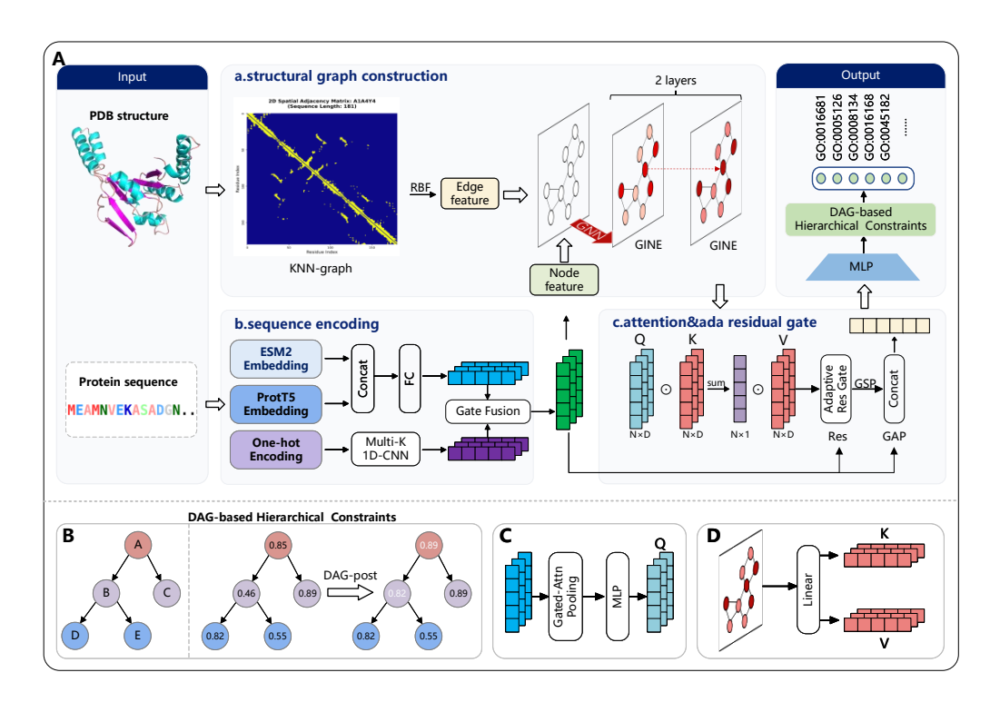

# DeepAMIGO

DeepAMIGO is a multimodal graph learning model for predicting protein functions as Gene Ontology (GO) terms. It combines residue-level protein language model embeddings, local sequence features, and a graph built from protein structure. This repository provides the Human model implementation, a checkpoint for each GO branch, and an executable three-protein molecular-function (MF) example.



*DeepAMIGO architecture. The structural graph and sequence features are combined through residue-level fusion, graph processing, attention, and an adaptive residual gate. GO DAG post-processing is applied to prediction scores after inference.*

## Key Features

- **Sequence encoding:** ESM-2 and ProtT5 residue embeddings are projected to a shared hidden space. A multi-scale one-dimensional CNN encodes 21-channel amino-acid one-hot features.
- **Structure-aware processing:** residues form graph nodes; spatial nearest-neighbour and adjacent sequence edges carry 16-dimensional radial basis function (RBF) distance features. Two residual GINE layers process the graph.
- **Context-guided fusion:** attention pooling derives protein-level context from language-model features. Cross-attention and a sample-wise adaptive residual gate combine the original and graph-processed residue representations.
- **GO prediction:** the classifier outputs scores in a fixed 1,244-term Human label space. Optional GO DAG post-processing propagates child scores to represented parent terms.

## Repository Structure

```text
DeepAMIGO/
├── DeepAMIGO/human/
│   ├── HUMAN_target_go_classes.json    # ordered BP, MF, CC GO terms
│   ├── HUMAN_target_indices.json       # output indices by GO branch
│   ├── HUMAN_target_filtered.json      # Human annotation metadata
│   └── src_model/
│       ├── model_ph2_bp_adptivea.py    # DeepAMIGO model
│       ├── dataset.py                  # prepared PyG graph loader
│       ├── metrics.py                  # evaluation metrics
│       ├── trainhum_sortauc.py         # Human training entry point
│       └── checkpoints_apa_{BP,MF,CC}/best_model.pth
├── examples/minimal_mf/
│   ├── inputs/                     # three sequences, structures, features, labels, GO subset
│   ├── run.py                      # graph → inference → DAG → metrics
│   └── README.md                   # exact inputs, command, and evaluation scope
├── figures/deepamigo_model.png
└── readme.md
```

## Data Preprocessing

### Protein sequences and residue features

The Human workflow uses up to the first 1,022 residues of each FASTA sequence. For every retained residue, the model expects a 2,560-dimensional ESM-2 (`esm2_t36_3B_UR50D`) embedding, a 1,024-dimensional ProtT5 (`Rostlab/prot_t5_xl_half_uniref50-enc`) embedding, and a 21-dimensional one-hot encoding. These arrays must have the same number of residues and be stored in the same order.

The three-protein example provides ESM-2, ProtT5, and one-hot features in `examples/minimal_mf/inputs/<protein>_features.pt`. These ready-to-use tensors allow the graph construction, inference, and evaluation steps to run without downloading the protein language models.

### Structural graph construction

The example reads each supplied PDB file, uses Cα coordinates from the first model and first chain, and constructs a residue graph. It adds up to 10 spatial nearest-neighbour edges per residue and bidirectional edges between adjacent sequence residues. Pairwise distances are expanded into 16 RBF edge features. The graph construction command is part of the runnable example below.

### GO labels and ontology

The Human classifier has **1,244 output positions**: 650 biological-process (BP), 314 molecular-function (MF), and 280 cellular-component (CC) terms. The JSON files under `DeepAMIGO/human/` define their fixed order. The MF example provides labels for its three proteins and the MF term records from the project's GO ontology snapshot. DAG score propagation operates within the fixed 314-term MF output space, using the supplied ground-truth labels for evaluation.

## Environment Setup

The three-protein example was checked on CPU with Python 3.12, PyTorch 2.5.1, PyTorch Geometric 2.6.1, NumPy 2.1.3, SciPy 1.16.0, scikit-learn 1.7.0, and Biopython 1.85. Install a mutually compatible PyTorch and PyTorch Geometric pair for your platform. From the **repository root**:

```bash
python -m pip install torch torch_geometric
python -m pip install numpy scipy scikit-learn biopython
```

## Run the Small Reproducibility Example

From the **repository root**:

```bash
python examples/minimal_mf/run.py
```

The command starts from three supplied FASTA sequences and PDB structures, constructs graphs, reads their saved residue features and labels, runs the released MF checkpoint, applies GO DAG score propagation, and calculates metrics. It writes:

| Output | Contents |
| --- | --- |
| `examples/minimal_mf/output/graphs.csv` | Residue and edge counts for each constructed graph |
| `examples/minimal_mf/output/predictions.csv` | GO target, raw score, and DAG score for every protein and MF term |
| `examples/minimal_mf/output/metrics.json` | Metrics before and after DAG score propagation |

See [the example README](examples/minimal_mf/README.md) for input provenance, checkpoint identity, metric definitions, and an alternate output path. The resulting metrics describe this three-protein workflow demonstration. Full-test-set performance is reported separately in the manuscript.

## Model Files and Evaluation Scope

The `best_model.pth` files in `checkpoints_apa_BP/`, `checkpoints_apa_MF/`, and `checkpoints_apa_CC/` correspond to the three Human GO branches. The executable example uses the **MF checkpoint** and fixed branch indices from `HUMAN_target_indices.json`. The model source and graph-data loader are also included. Full benchmark training and evaluation use the prepared graph dataset, its defined splits, and the study's evaluation protocol.

## Data Availability

The code, three Human model checkpoints, GO label mappings, and [three-protein executable example](examples/minimal_mf/) are stored in this repository. The example includes its FASTA sequences, PDB structures, saved residue features and labels, and the MF GO ontology subset required by the command above. The complete Human graph dataset is maintained separately; this repository distributes the input set used by the executable example.

## Intended Use

This repository provides the DeepAMIGO implementation, trained Human checkpoints, and a documented workflow from representative inputs to GO predictions and metrics. The three-protein example is designed to make each processing step directly inspectable.
